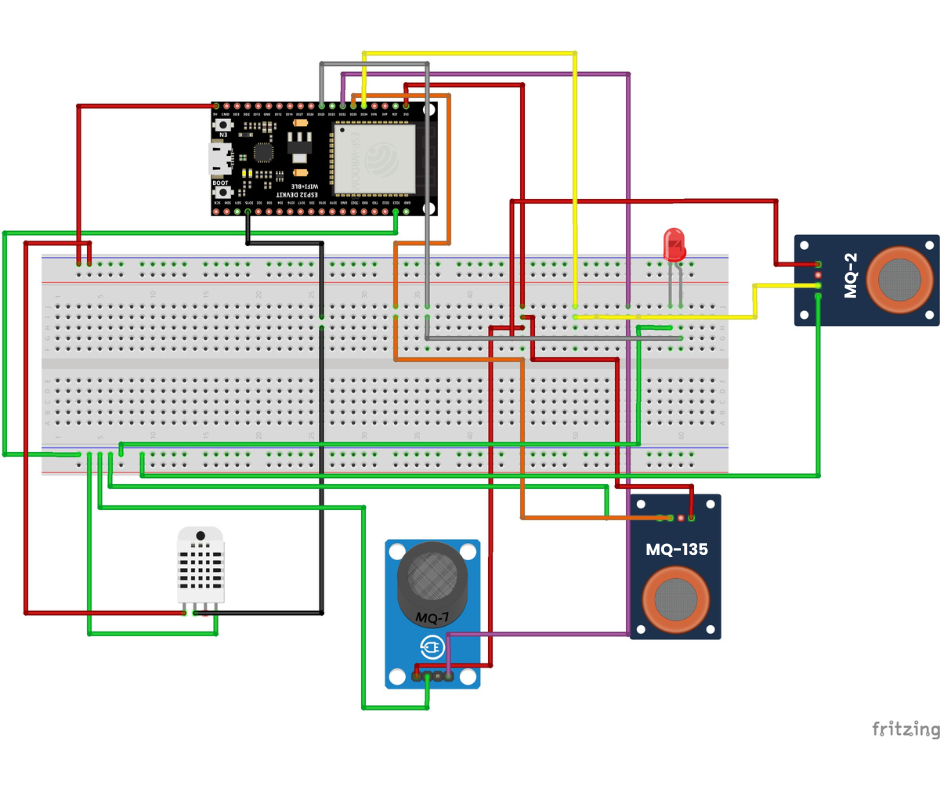

# :wind_face: Projeto de Monitoramento de Qualidade do Ar com ESP32 e Sensores MQ

## :bulb: Descrição do Projeto
Este projeto utiliza um ESP32 para monitorar a qualidade do ar, detectando gases como CO2, GLP e CO por meio de sensores específicos (MQ-135, MQ-2 e MQ-7). O sistema conecta-se à internet via Wi-Fi e transmite os dados dos sensores para um broker MQTT. Além disso, o sistema inclui um sensor DHT22 para medir temperatura e umidade, e um LED que acende automaticamente quando os níveis de gases ultrapassam os limites definidos. Esse projeto é ideal para monitoramento de áreas industriais ou ambientes internos com alta concentração de poluentes.

## :memo: Software e Documentação
O software foi desenvolvido em C++ utilizando a IDE Arduino. O código está documentado e organizado em funções para conexão com Wi-Fi, comunicação via MQTT, leitura dos sensores, e publicação de dados. O código está disponível neste repositório e inclui as seguintes bibliotecas:
- `WiFi.h` para conexão Wi-Fi.
- `PubSubClient.h` para comunicação MQTT.
- `DHTesp.h` para o sensor DHT22.
- `MQUnifiedsensor.h` para a série de sensores MQ.

### :computer: Principais Funções:
- `setup_wifi()`: Conecta o ESP32 à rede Wi-Fi.
- `reconnect()`: Mantém a conexão com o broker MQTT.
- `publishGasReading()`: Lê e publica os dados de cada sensor de gás.
- `initAndCalibrateSensor()`: Inicializa e calibra os sensores MQ.

## :electric_plug: Hardware Utilizado
- **ESP32**: Placa principal que controla o sistema e se conecta à internet.
- **Sensores de Gás**:
  - **MQ-135**: Sensor para CO2.
  - **MQ-2**: Sensor para GLP.
  - **MQ-7**: Sensor para CO.
- **DHT22**: Sensor de temperatura e umidade.
- **LED**: Indica níveis elevados de gases.
- **Pinos e Componentes**:
  - `GPIO 25`: Pino do LED.
  - `GPIO 35`, `GPIO 34`, `GPIO 32`: Pinos de leitura para os sensores MQ.

## :speaking_head: Comunicação e Protocolos
Este projeto utiliza comunicação TCP/IP para conexão à internet e o protocolo MQTT para enviar dados ao servidor de monitoramento. O ESP32 conecta-se a um broker MQTT (exemplo: `test.mosquitto.org`) onde os dados são publicados e assinados para troca de informações.

### Tópicos de MQTT:
- `/Bia/temp`: Publica a temperatura.
- `/Bia/hum`: Publica a umidade.
- `/Bia/co2`, `/Bia/glp`, `/Bia/co`: Publica as leituras de CO2, GLP e CO respectivamente.

### Principais Interfaces e Protocolos:
- **Wi-Fi (TCP/IP)**: Conecta o ESP32 à rede e permite o envio dos dados dos sensores.
- **MQTT**: Protocolo de comunicação leve e eficiente, utilizado para publicar os dados no broker.

## :gear: Configurações
Certifique-se de ajustar as credenciais de Wi-Fi e o endereço do broker MQTT conforme necessário:
```
const char* ssid = "SEU_SSID";
const char* password = "SUA_SENHA";
const char* mqtt_server = "SEU_BROKER_MQTT";
```

## :hammer_and_wrench: Montagem do Circuito

Abaixo está o diagrama de montagem do circuito. Siga o desenho para conectar o ESP32, os sensores de gás (MQ-135, MQ-2, e MQ-7), o sensor de temperatura e umidade (DHT22), e o LED à protoboard. Este esquema garante que todos os componentes estejam conectados corretamente para o funcionamento do protótipo.



> **Nota**: Certifique-se de conectar cada sensor ao pino correto do ESP32, conforme especificado no código e na imagem acima. Os pinos de alimentação (VCC e GND) devem estar conectados a uma fonte de alimentação apropriada.

### :robot: Componentes e Conexões
- **ESP32**: Microcontrolador principal.
- **Sensores MQ**: Sensores de gás MQ-135, MQ-2 e MQ-7 para detecção de CO2, GLP e CO, respectivamente.
- **DHT22**: Sensor de temperatura e umidade.
- **LED**: Indicador visual que acende em caso de detecção de níveis elevados de gases.

### :scroll: Instruções
1. Conecte cada componente aos pinos especificados no ESP32 conforme ilustrado.
2. Utilize jumpers para ligar os sensores e o LED à protoboard, conforme o diagrama.
3. Verifique as conexões de alimentação para garantir que o circuito está devidamente energizado.


